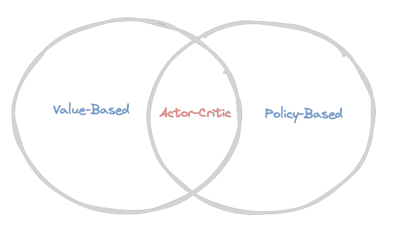
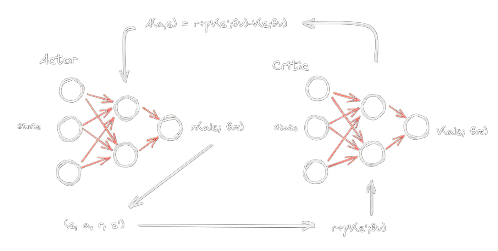

# Metodo Actor-Critic

## Metodo baseado em valor e metodo baseado em politica

Para entender os conceitos de um agente baseado no método de valor, como o DQN (Deep Q-Network), e um agente baseado em política, como o REINFORCE, é fundamental compreender que ambos têm como objetivo utilizar o aprendizado por reforço para ensinar a um agente como realizar uma tarefa.

Um agente baseado em valor avalia cada ação tomada em um determinado estado atribuindo um valor numérico a ela. Esse valor representa o quão vantajosa a ação é para alcançar o objetivo da tarefa. Se uma ação leva o agente mais próximo do objetivo, ela receberá uma recompensa maior. Por outro lado, se uma ação leva o agente para longe do objetivo ou tem resultados indesejáveis, ela pode receber uma recompensa menor ou até mesmo uma recompensa negativa (penalização).

Já um agente baseado em política depende de um "conselheiro" para orientar suas decisões. Nesse caso, o "conselheiro" é uma pessoa experiente que já sabe como realizar a tarefa com sucesso. O agente, por sua vez, é como um iniciante que está aprendendo a realizar a tarefa e segue as sugestões do "conselheiro" para tomar suas ações.

Ambas as abordagens têm como objetivo ensinar ao agente como realizar uma tarefa através do aprendizado por reforço. Um agente baseado em valor utiliza recompensas (ou penalizações) para avaliar suas ações em relação ao objetivo, enquanto um agente baseado em política se apoia em conselhos externos para tomar decisões. Cada abordagem possui suas aplicações e vantagens, dependendo do tipo de problema que estão sendo usadas para resolver.

::: tip Método Baseado em Política e Método Baseado em Valor
Vamos considerar uma pessoa que está tentando jogar tênis. Após uma partida, ela retorna para casa e reflete sobre o jogo, buscando melhorar seus acertos e reduzir os erros cometidos durante a partida. No dia seguinte, ela leva em conta essas reflexões e tenta realizar as jogadas corretas. Essa abordagem é conhecida como método baseado em política.

Agora, vamos imaginar o mesmo jogador entrando em uma nova partida, mas desta vez, em vez de se concentrar apenas em ações corretas, ele tenta estimar o valor do jogo total a cada jogada. Quanto mais partidas ele joga, melhor ele se torna em estimar o placar final do jogo. Essa abordagem é chamada de método baseado em valor.

Na primeira analogia, a pessoa aprende a agir corretamente, buscando melhorar suas ações com base nas experiências passadas e nas reflexões sobre o jogo anterior. Já na segunda analogia, a pessoa tenta aprender a avaliar a qualidade de suas ações em relação ao objetivo geral (placar final do jogo), utilizando a estimativa do valor do jogo em cada jogada.
:::

## Aproximação de Funções

O método baseado em valor utiliza uma rede neural ou outra função de aproximação para estimar a função de valor, que atribui uma nota para cada ação tomada em um determinado estado. Essa aproximação pode ser feita por meio de funções de transferência como `Vπ(S)` (função de valor do estado), `Qπ(S, A)` (função de valor do estado-ação) e `Aπ(S, A)` (função de vantagem, medindo a vantagem de tomar uma ação A em relação a outras ações no estado S).

Geralmente, quando um agente aprende uma função de valor, ele pode prosseguir para o aprendizado baseado em política com conhecimento prévio. Nesse ponto, o agente aprende a parametrizar a política e a otimizá-la diretamente. A política é geralmente estocástica, denotada como `π(s|a)`, o que significa que ela introduz aleatoriedade na escolha das ações com base em probabilidades. Isso permite ao agente explorar diferentes ações e evitar ficar preso em um único comportamento. Por outro lado, uma política determinística, denotada como `π(s)`, sempre escolhe a mesma ação para cada estado específico, sem envolver aleatoriedade na tomada de decisões.

## Viés e Variação

O método Actor-Critic é uma abordagem que utiliza o agente baseado em valor para aprender a função de valor e, em seguida, utiliza-a como linha de base para treinar o agente baseado em política.

Essa técnica é adotada para resolver o problema do alto viés relacionado à simplificação ou suposições feitas pelo modelo e alta variância relacionada ao agente aprender com novos dados em geral. Ao tentar estimar a função de valor ou política com base no retorno G (soma das recompensas obtidas pelo agente ao longo de uma sequência de ações), há alto viés e variância.

Existem duas formas de estimar o retorno. Uma delas é o método de Monte Carlo, onde o agente acumula a recompensa ao longo de um episódio, considerando desconto ou não. Para calcular a função de valor, ele acumula vários episódios, em cada um deles computando a soma das recompensas, e depois calcula a média das estimativas.

A outra forma é a estimativa por TD (diferença temporal), que leva em consideração tanto as recompensas imediatas quanto as estimativas de recompensas futuras.

::: tip Analogia entre viés e variação
Imagine um jogador de futebol tentando acertar o gol. O viés é quando ele sempre chuta da mesma maneira, tornando-se previsível e fácil de defender. Já a variação é quando ele chuta de forma muito diferente a cada tentativa, o que torna seus chutes imprevisíveis e pouco precisos. Para ser um bom atacante, ele precisa encontrar um equilíbrio entre ser consistente (viés baixo) e ter chutes precisos (variação adequada), aumentando suas chances de marcar gols com frequência. Da mesma forma, em aprendizado de máquina, encontrar esse equilíbrio entre viés e variação é fundamental para desenvolver modelos com bom desempenho e capacidade de generalização.
:::

::: details Estimativa de retorno TD (difereca temporal):

#### V(s) ← V(s) + α * [R + γ * V(s') - V(s)]

Onde:

* V(s) é o valor estimado do estado atual "s" (a estimativa de quanta recompensa o agente espera obter a partir desse estado).
* V(s') é o valor estimado do próximo estado "s'" (a estimativa de quanta recompensa o agente espera obter a partir do próximo estado).
* R é a recompensa imediata recebida pelo agente após tomar uma ação no estado "s".
* α (alfa) é a taxa de aprendizado, que controla o quanto a estimativa é atualizada a cada passo de aprendizado.
* γ (gama) é o fator de desconto, que controla o peso das recompensas futuras em relação à recompensa imediata. Ele deve estar entre 0 e 1, onde 0 significa que o agente só se importa com a recompensa imediata, e 1 significa que o agente considera todas as recompensas futuras igualmente importantes.
:::

::: details Estimativa de retorno Monte Carlo:

#### (G) = R₁ + γ * R₂ + γ² * R₃ + ... + γ^(n-1) * Rₙ

Onde:

* G é o retorno total com desconto, ou seja, a soma das recompensas (R) ponderadas pelos fatores de desconto γ em cada passo do episódio.
* R₁, R₂, R₃, ..., Rₙ são as recompensas obtidas em cada um dos n passos do episódio.
* γ (gama) é o fator de desconto, que controla o peso das recompensas futuras em relação à recompensa imediata. Ele deve estar entre 0 e 1, onde 0 significa que o agente só se importa com a recompensa imediata, e 1 significa que o agente considera todas as recompensas futuras igualmente importantes.
:::

## Estimativa de retorno

Uma diferença entre o uso do método de Monte Carlo é que, no início, ele retorna muitos valores aleatórios, pois em cada episódio as recompensas e ações são aleatórias. Isso faz com que demore mais para aprender, mas os valores obtidos são verdadeiros, pois o método de Monte Carlo não faz estimativas em cima de estimativas. Por outro lado, o método TD realiza estimativas em cima de estimativas, pois após uma etapa de estado, ação e recompensa, não há muito mais a saber. Esse método aprende mais rápido, mas pode demorar mais para convergir para um aprendizado verdadeiro. Logo, MC possui baixo viés, mas alta variância, e o TD possui alto viés, mas baixa variância.

O método Actor-Critic utiliza o melhor dos dois mundos, empregando o método TD para estimar o retorno e o método MC para estimar a função de valor.

Assim, utilizamos o TD como linha de base para treinar o agente, pois o principal foco é reduzir a variância, adicionando um pouco de viés. Claro que o método MC não possui viés, mas possui alta variância. No caso do Actor-Critic, onde os estados são contínuos, ter uma alta variância pode causar ainda mais complexidade ao modelo, pois os métodos baseados em política têm alta variância.

Dessa forma, os agentes baseados em Actor-Critic aprendem treinando e ajustando as probabilidades de boas e más ações, assim como um ator sozinho, e utilizam um crítico para distinguir as boas das más ações. Esse método é mais estável do que os métodos baseados em valor e requer menos dados do que os baseados em políticas.

## Modelo Actor-Critic

No método Actor-Critic, são utilizadas duas redes neurais, uma para o crítico e outra para o ator. O crítico aprende a avaliar a função de valor do estado `Vπ(S)` utilizando o método TD (Diferença Temporal) como estimativa. Com base nas estimativas do crítico, a função de vantagem é calculada e usada para treinar o ator.

::: details A estrutra do modelo é a seguinte:
* **A rede do ator recebe o estado e retorna a probabilidade de cada ação `π(a|s; θπ)`.**
     * a -> acao
     * s -> estado
     * θπ -> parametros da rede do ator
* **A rede do critico recebe o estado e retorna a funcao de valor `V(s; θv)`.**
     * s -> estado
     * θv -> parametros da rede do critico
* **O estado é passado para rede do ator e gera uma ação, que é passada para o ambiente.**
* **Retorna o conjunto (s, a, r, s') -> (estado, ação, recompensa, proximo estado)**
* **Utilizando a estimativa TD que é `r + γ * V(s') - V(s)` para treinar o critico.**
     * `r + γ * V(s') - V(s)` -> estimativa TD
     * r -> recompensa
     * γ -> fator de desconto
     * `V(s')` -> funcao de valor do proximo estado
     * `V(s)` -> funcao de valor do estado atual
* **O critico retorna a funcao de valor do estado atual e do proximo estado.**
     * `V(s)` -> funcao de valor do estado atual
     * `V(s')` -> funcao de valor do proximo estado
     * r -> recompensa
     * γ -> fator de desconto
* **Em seguida, calcula a funcao de vantagem `A(s, a) = r + γ * V(s') - V(s)` e utiliza para treinar o ator.**
     * `A(s, a)` -> funcao de vantagem
     * r -> recompensa
     * γ -> fator de desconto
     * `V(s')` -> funcao de valor do proximo estado
     * `V(s)` -> funcao de valor do estado atual
:::

## DDPG (Deep Deterministic Policy Gradient) [Paper](https://arxiv.org/abs/1509.02971)

O DDPG (Deep Deterministic Policy Gradient) é uma extensão do DQN que permite lidar com tarefas contínuas, pois utiliza uma rede neural para aproximar a função de valor de ação `Q(s, a)`.

No exemplo de modelo Actor-Critic, o ator retorna a probabilidade de cada ação, mas no DDPG, o ator retorna a ação diretamente, ou seja, o ator escolhe diretamente a ação a ser tomada. Essa ação é calculada através de argmax `Q(s, a)`, ou seja, selecionando a ação que maximiza a função de valor de ação `Q(s, a)`, tornando a política determinística. Enquanto isso, o crítico aprende a avaliar a função de valor da ação ideal usando a ação mais acreditada pelo ator, ou seja, avalia como a ação selecionada pelo ator é vantajosa em relação às outras ações possíveis naquele estado. Esse cálculo é feito por `Q(s, U(s;θu); θq)`.

Para treinar a rede crítica no DDPG, é utilizado o `replay buffer` para armazenar experiências passadas. O replay buffer é uma memória que permite ao algoritmo coletar e reutilizar experiências para o treinamento da rede de forma mais eficiente.

Além disso, o DDPG utiliza uma técnica conhecida como `soft update` para atualizar os pesos das redes alvo e regular, tanto para o ator quanto para o crítico. A rede alvo é atualizada com base nos pesos da rede regular, utilizando a seguinte fórmula: `θ_target = τ * θ_local + (1 - τ) * θ_target`. O parâmetro τ controla a taxa de atualização dos pesos da rede alvo e é um hiperparâmetro importante para o treinamento do DDPG.